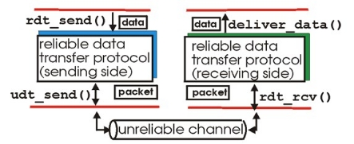

Project 2 – Reliable Data Transmission (RDT) 

Introduction 

In this project you will code part of a simulation in order to understand the principles and practice of Reliable Data Transmission (RDT). You will complete the RDTLayer class that allows the transfer of string data through an unreliable channel in a simulated sendreceive environment. 

 

Code for the UnreliableChannel class, the Segment class (data or ack packets\*\*), and also the calling main function, is provided. You will need to complete the implementation for the RDTLayer class. Note that there is an instance of RDTLayer for both sender and receiver (see rdt\_main.py). The RDTLayer must therefore be able to send and receive data and ack segments. 

Your code should be able to simulate many of the features discussed in your textbook for RDT and TCP. Note that we will not be using actual TCP headers or bytes. This is more high-level than that, but the principles are the same. 

RDTLayer 

The RDTLayer class needs to provide reliable transport no matter how bad the unreliable channel is at delivering packets. And it is bad! The UnreliableChannel class may do any of the following: 

- Deliver packets out-of-order (data or ack packets) 
- Delay packets by several iterations (data or ack packets) 
- Drop packets (data or ack packets) 
- Experience errors in transmission (failed checksum - data packets only) 
- Various combinations of the above 

*\*\*The words ‘segment’ and ‘packet’ are frequently used interchangeably with TCP communications.* 

The RDTLayer class must handle all of these and deliver the data correctly and as efficiently as possible. In this project, you must finish the implementation of the RDTLayer class. To help build your RDTLayer implementation, the UnreliableChannel class takes flags that can turn on/off the different types of unreliability. It is recommended that you use those flags, starting with completely reliable channels, get that working, and go from there, enabling each of the unreliable features in turn.  

Note that the Segment class already has methods for calculating and checking the checksum. It also has methods for saving a ‘timestamp’ (iteration count). We will be using iteration count instead of time, because the simulation executes much too quickly to use actual time. 

Your final RDTLayer implementation must: 

- Run successfully with the original provided UnreliableChannel and Segment classes 
- Deliver all of the data with no errors 
- Succeed even with all of the unreliable features enabled 
- Send multiple segments at a time (pipeline) 
- Utilize a flow-control ‘window’ 
- Utilize cumulative ack 
- Utilize selective retransmit 
- Include segment ‘timeouts’ (use iteration count, not actual time) 
- Abide by the payload size constant provided in the RDTLayer class 
- Abide by the flow-control window size constant provided in the RDTLayer class 
- Efficiently run with the fewest packets sent/received. Who can transmit all of the data with the fewest iterations? 

E

xample screenshots:

What to turn in

1. Include a copy of all of your code. 
1. In rdt\_main.py, you will see two different length texts to send through the RDTLayer. Start with the smaller one, then try the larger one. 
1. Take screenshots of your running code for both the larger and smaller texts and include it in your submission doc.** 
1. Add any comments/questions to your submission doc.** 
